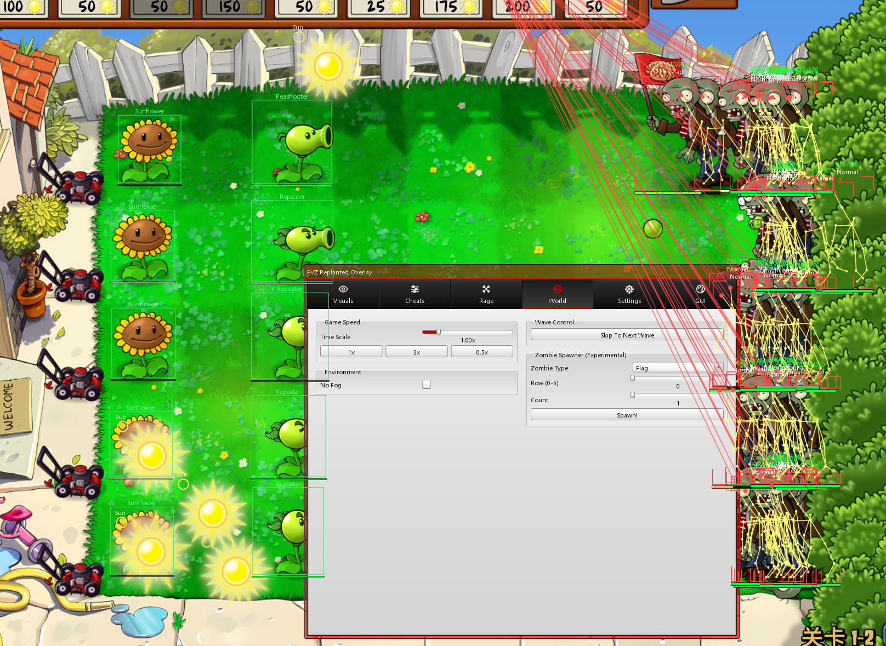
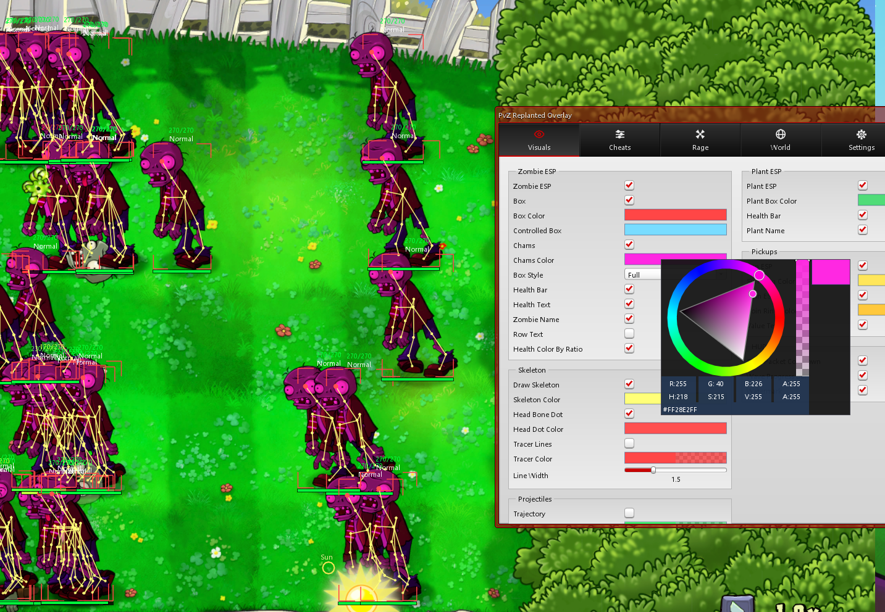
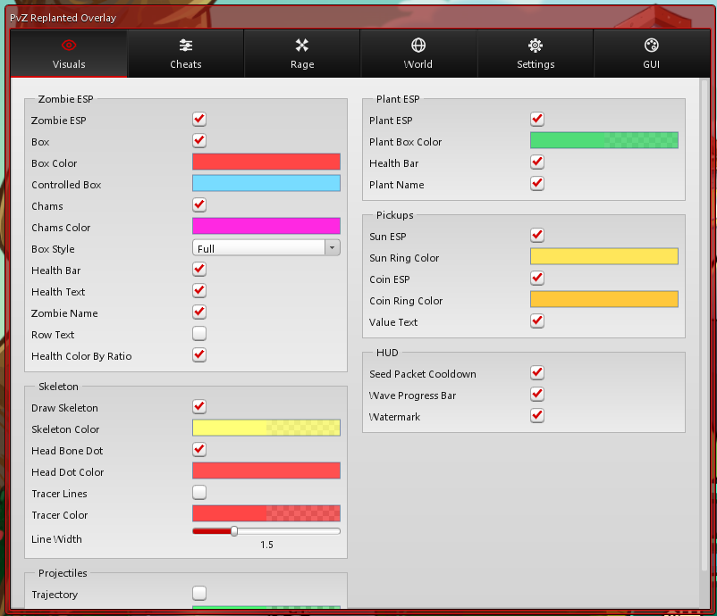
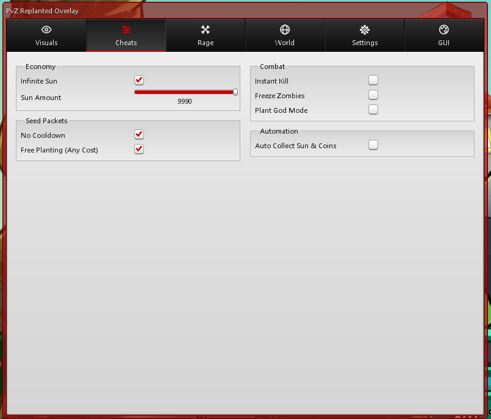
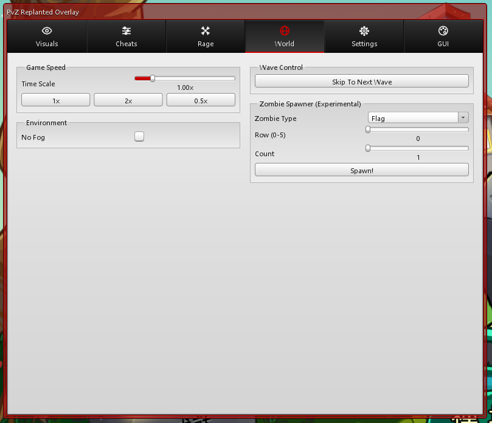
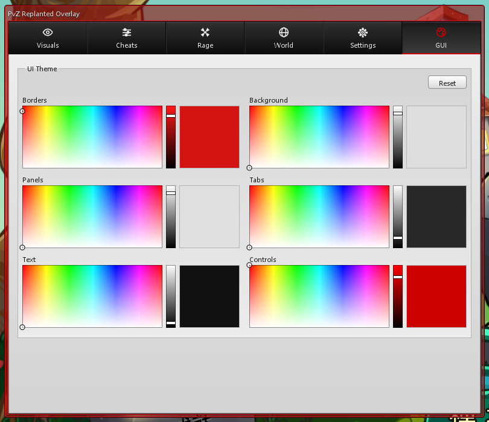

# PvZ Replanted Overlay（修改菜单）

<p align="center">
  
</p>

[English](#english) | 中文

针对 **Plants vs. Zombies Replanted**（Unity IL2CPP 重制版）的原生 D3D11 覆盖层修改菜单：透视、骨骼、彩人、弹道、经济/战斗/狂暴类修改、变速、波次控制、僵尸生成器、实时 UI 主题编辑与完整中英文双语界面。

> ⚠️ **免责声明**：本项目仅供单机游戏的学习与技术研究（IL2CPP 反射、D3D11 钩子、内存读写），不得用于任何多人/竞技场景或商业用途。使用者自行承担一切风险。本项目与 PopCap / EA 无任何关系，请支持正版游戏。

---

## 目录
- [功能总览](#功能总览)
- [快速开始](#快速开始)
- [菜单页面详解](#菜单页面详解)
- [注入器详解](#注入器详解)
- [从源码构建](#从源码构建)
- [配置文件参考](#配置文件参考)
- [常见问题](#常见问题)
- [项目结构](#项目结构)
- [已知限制](#已知限制)

---

## 功能总览

### 🎯 视觉 / Visuals

| 功能 | 说明 |
|---|---|
| 僵尸 ESP | 方框（四角样式 / 完整边框 / 关闭三档）、血条（分段显示本体/头盔/护盾）、血量文字、僵尸名字、行号文字 |
| 血量变色 | 血量按剩余比例从绿到红渐变（可关，关闭后固定绿色） |
| 颜色系统 | 方框 / 魅惑方框 / 骨骼 / 头点 / 射线 / 植物框 / 阳光圈 / 金币圈 / 弹道 全部可自定义颜色与透明度 |
| 骨骼绘制 | 读取僵尸 Spine 骨骼链并绘制可见姿态（躯干/四肢/头部），带关节点 |
| 头部标记 | 头部骨骼点高亮圆点（无骨骼时用框顶中心） |
| 射线 | 屏幕顶部中点指向每个僵尸头部的辅助线 |
| 彩人 Chams | 直接对僵尸的 Spine 骨骼整体着色——**游戏内本体变色**，雾天/黑夜关卡也醒目；被魅惑菇控住的僵尸自动用魅惑色区分；关闭或僵尸死亡时自动还原原色 |
| 弹道显示 | 直线平飞投射物（豌豆/双发/机枪等）的飞行弹道线，起点带圆点标记 |
| 掉落物 | 阳光 / 金币 / 钻石 / 奖杯的圈选标记 + 面值文字 |
| HUD | 屏幕左侧卡槽冷却充能条（充能方向空→满，就绪变绿）、顶部波次进度条、调试水印（帧率/僵尸数/阳光数） |

### ⚡ 作弊 / Cheats

| 功能 | 说明 |
|---|---|
| 无限阳光 | 每帧把阳光数值锁定为设定值（默认 9990，可调 10–9990） |
| 无冷却 | 种子卡冷却立即就绪（直接写满冷却计数） |
| 免费种植 | 任意阳光数都能种（开启游戏自带的作弊开关） |
| 秒杀 | 所有存活僵尸血量清零 |
| 冻结僵尸 | 写入游戏原生冰冻状态（寒冰菇同款），带结冰视觉效果；只冻已上草坪的僵尸，屏幕外的正常走进来，避免最后一波无法结算 |
| 植物无敌 | 植物血量每帧回满 |
| 自动收集 | 阳光与金币落地即入账——调用游戏自身的收集方法（加阳光/加钱+音效），而非传送坐标 |

### 🔥 狂暴 / Rage

| 功能 | 说明 |
|---|---|
| 魔法子弹 | 豌射手系子弹跨行命中：本行前方没有目标时，子弹每帧向其他行最近的僵尸所在行引导，划出弧线命中；本行有目标时不干预（保持自然弹道） |

### 🌍 世界 / World

| 功能 | 说明 |
|---|---|
| 时间流速 | 0.1x – 5x 无级调节，附 1x / 2x / 0.5x 快捷按钮 |
| 无雾 | 迷雾关卡永久吹散 |
| 跳到下一波 | 立即结束当前波次 |
| 僵尸生成器 | 38 种僵尸类型 × 行号（0–5）× 数量（1–10），一键批量生成（实验性） |

### ⚙️ 设置 / Settings

| 功能 | 说明 |
|---|---|
| 配置管理 | 配置名输入框 + 读取 / 保存 / 重置 / 新建 四按钮 |
| 按键绑定 | 菜单开关键、紧急隐藏键（点击后按任意键绑定，右键清除） |
| 语言切换 | 中文 / English 一键切换，菜单与全部 ESP 文本即时生效 |
| 卸载 | 从游戏进程安全卸载 DLL |

### 🎨 界面 / GUI

完整的实时 UI 主题编辑器，**六色体系**：

| 颜色槽 | 控制范围 |
|---|---|
| 边框 Border | 主窗口外框、分组框边框、分割线 |
| 背景 Background | 主内容区背景（四个页面 + 滚动条） |
| 面板 Panel | 分组框内部底色 + 控件中性表面（输入框/滑轨/按钮底色） |
| 标签页 Tab | 顶部导航的默认/悬浮/选中三态渐变 |
| 文字 Text | 全部界面文字（深色背景自动取补色保持可读） |
| 控件 Control | 强调色：对勾、滑条填充、按钮悬浮、选中标签页图标与底部强调线 |

每个颜色槽 = 二维色场（色相×饱和度）+ 竖向明度条 + 实时预览块；**改动即时生效无需 Apply**，停止编辑约 1.5 秒后自动写入配置文件；右上角 Reset 一键恢复默认主题。默认主题即经典红框浅灰风格。

### 🌐 双语
菜单全部标签、分组、按钮、下拉项、标签页名与全部 ESP 文本（僵尸/植物/掉落物名字、波次文字、状态标记）均支持中英文切换，配置持久化。

---

## 快速开始

### 环境要求
- Windows 10 / 11 x64
- Plants vs. Zombies Replanted（Unity IL2CPP x64 版本，D3D11 渲染）

### 第一次使用
1. 从 [Releases](../../releases) 下载最新版的两个文件（DLL 与注入器），放进**同一个文件夹**
2. 启动游戏
3. **双击注入器**（详见[注入器详解](#注入器详解)）——窗口会显示选中了哪个 DLL、注入到哪个进程，按任意键关闭
4. 游戏内按 `Insert` 开关菜单，`F11` 紧急隐藏全部绘制
5. 选项改动即时生效；主题与大部分设置会自动保存，下次启动自动恢复

### 按键
| 按键 | 功能 | 可否改键 |
|---|---|---|
| `Insert` | 菜单开关 | ✅ 设置 → 按键绑定 |
| `F11` | 紧急隐藏（全部绘制立即消失，再按恢复） | ✅ 同上 |

---

## 菜单页面详解

菜单为经典桌面风格（紧凑、高信息密度、0–3px 圆角），顶部六个标签页，图标居上文字居下：

**视觉**：左列「僵尸 ESP」（含彩人）+「骨骼」+「弹道」，右列「植物 ESP」+「掉落物」+「信息显示」。
**作弊**：左列「经济」+「卡槽」，右列「战斗」+「自动化」。
**狂暴**：整页「狂暴」面板（魔法子弹）。
**世界**：左列「游戏速度」+「环境」，右列「波次控制」+「僵尸生成器（实验）」。
**设置**：左列「配置」+「按键绑定」+「语言」，右列「关于」+ 卸载按钮。
**界面**：整页主题编辑器（六色块 2×3 网格 + 右上角重置）。

颜色编辑通用操作：点击色条弹出取色器（色轮 + RGB/RGBA + 吸管式调节），或直接输入十六进制。

---

## 注入器详解

双击即用，全自动流程：

1. **选 DLL**：不指定参数时，自动选取注入器所在目录里**修改时间最新**的 `*.dll`，并在控制台第一行显示文件名与时间——一眼确认没有注入旧版本
2. **找进程**：按进程名子串匹配游戏（默认 `replanted`）；游戏没开就每 0.5 秒轮询等待，最长 10 分钟（Ctrl+C 取消）——先开注入器再开游戏的顺序也完全可以
3. **防双注入**：跳过已加载过本工具 DLL 的进程；多个游戏实例并存时自动选择**尚未注入**的那个
4. **执行注入**：`CreateRemoteThread + LoadLibraryA`；远端返回空句柄（杀软拦截/依赖缺失）时明确报错
5. **结束暂停**：显示结果后等按键再关闭，双击运行也能看清输出

命令行参数（一般用不到）：
```
injector.exe [DLL路径] [-p 进程名子串] [-nowait] [-nopause]
```

---

## 从源码构建

### 准备
- **Visual Studio 2022 生成工具**：勾选「使用 C++ 的桌面开发」（MSVC v143 + Windows 10/11 SDK）
- **CMake**（VS 安装器里的 C++ CMake 工具组件即可）
- 约 1GB 磁盘空间

### 步骤
1. 克隆仓库（含 `vendor/` 第三方依赖，克隆即齐）
2. 双击 `build.bat`：
   - 首次运行自动用 CMake 配置并编译 FreeType 2.14.3（静态库，约 1–2 分钟）
   - 之后编译主 DLL 与注入器，产出在 `build/` 目录
3. 若 `build/` 里的 DLL 被正在运行的游戏锁定，脚本会自动改用备用文件名编译，并启动 `sync_dll.bat` 在后台等待游戏关闭后自动同步回正式文件名

### 技术栈
C++17 · MinHook（函数钩子）· Dear ImGui + FreeType（界面与字体）· il2cpp 运行时 API 直调（按名解析类/字段/方法，不硬编码偏移，游戏小版本更新可自愈）。

架构详情见 [docs/ARCHITECTURE.md](docs/ARCHITECTURE.md)。

---

## 配置文件参考

配置为 INI 格式，路径默认在构建目录（`build/config.ini`），游戏进行中修改选项后自动或手动保存：

| 分区 | 内容示例 |
|---|---|
| `[ui.visuals]` | `zombie_esp=1`、`chams=1`、`zombie_box_color=#FF4646FF`、`line_w=1.5` 等全部视觉开关与颜色 |
| `[ui.cheats]` | `infinite_sun`、`no_cooldown`、`instant_kill`、`magic_bullets` 等 |
| `[ui.world]` | `time_scale`、`no_fog`、生成器参数 |
| `[ui.settings]` | `config_name`、`menu_toggle_key`、`panic_key`、`zh_text` |
| `[ui.theme]` | 界面主题六色（`Borders` / `Background` / `Panels` / `Tabs` / `Text` / `Controls`，`#RRGGBB`） |
| `[ui.menu]` | `active_tab`（上次停留页面） |

颜色格式：游戏颜色 `#RRGGBBAA`（含透明度），主题颜色 `#RRGGBB`。
**游戏内 ESP 颜色与界面主题是两套完全独立的配置，互不影响。**

---

## 常见问题

**Q：双击注入器后窗口一闪而过？**
不会——注入器结束时会等按键。如果之前下载的是旧版才有此现象。

**Q：注入器显示 all matching processes already injected？**
当前运行的游戏已经注入过了。想注入新版本：关闭游戏重开再注入即可。

**Q：杀毒软件报毒/拦截？**
内存注入类工具常被误报。可将目录加入白名单；远端加载失败时注入器会明确提示。

**Q：菜单打不开？**
确认游戏是 D3D11 渲染；确认按的是绑定键（默认 Insert，可在配置里查 `menu_toggle_key`）。

**Q：ESP 方框和僵尸对不齐？**
已知限制（见下）。彩人、修改类功能不受影响。

**Q：改了主题后下次启动没保存？**
主题在停止编辑约 1.5 秒后自动落盘；也可在设置页点保存立即写入。

---

## 项目结构

```
src/
  dllmain.cpp        入口与初始化顺序（il2cpp → 配置 → D3D11 钩子）
  dx11_hook.cpp      Present 钩子、ImGui 帧循环、ESP 绘制
  game_data.cpp/h    il2cpp 按名反射、每帧快照、修改类逻辑、双语名字表
  il2cpp_api.cpp/h   GameAssembly.dll 运行时 API 绑定
  projection_math.h  正交投影数学
  injector/          独立注入器（单文件）
  render/            菜单 UI：自绘控件、主题系统、双语层、页面布局
  config/            INI 读写、持久化、按键名解析
  app/               生命周期与卸载
vendor/              imgui / freetype / minhook
docs/                文档与截图
```

---

## 已知限制
- ESP 方框与僵尸本体的屏幕对齐存在历史性偏差（正交相机链路），方框/骨骼/射线类功能可能整体偏移；**彩人与全部修改类功能不依赖该链路，不受影响**
- 仅支持 D3D11 渲染模式
- 部分修改（冻结、秒杀）对特殊关卡实体可能不生效

## 截图

**游戏内实际效果**（菜单关闭状态：僵尸 ESP 方框 / 彩人隔树篱透视 / 血条 / 顶部射线同时开启，1-2 关满阵）：


**视觉页（Visuals）**——ESP / 彩人 / 弹道全部开关与颜色自定义，右上角取色器展开中：



**视觉页完整概览**——僵尸 ESP、骨骼、弹道、植物 ESP、掉落物、HUD 六大分组全貌：



**作弊页（Cheats）**——无限阳光、无冷却、免费种植、瞬杀、冻结、植物无敌、自动收集：



**世界页（World）**——时间倍速、去雾、跳波、实验性僵尸生成器：



**界面页（GUI）**——六色实时主题编辑器（边框/背景/面板/标签/文本/控件），一键还原：



> 📷 狂暴页（Rage）与设置页（Settings，含中英文切换）截图待补充。

---

# English

# PvZ Replanted Overlay

A native D3D11 overlay mod menu for **Plants vs. Zombies Replanted** (Unity IL2CPP remake): ESP, skeleton, chams, projectile trajectories, economy/combat/rage cheats, time scale, wave control, a zombie spawner, a live UI theme editor, and full Chinese/English localization.

> ⚠️ **Disclaimer**: For single-player educational/research use only (IL2CPP reflection, D3D11 hooking, memory R/W). Not for multiplayer or commercial use. Not affiliated with PopCap/EA. Use at your own risk.

## Features

- **Visuals**: zombie ESP (corner/full boxes, segmented HP bars, HP text, names, rows), ratio-based HP coloring, fully customizable colors with alpha, Spine skeleton rendering with joints, head markers, top tracers, **chams** (whole-body tint through the game's own Spine skeleton color — visible through fog; mind-controlled zombies tinted separately; original colors restored on disable/death), projectile trajectory lines, pickup rings with value text, seed-cooldown HUD, wave progress bar, diagnostic watermark
- **Cheats**: infinite sun (configurable 10–9990), instant seed cooldown, free planting, instant kill, freeze (native ice-trap state with visuals; only on-lawn zombies so the final wave can still resolve), plant god mode, auto-collect (invokes the game's own collect logic — real sun/money + sound)
- **Rage**: magic bullets — when a pea's own row has no target ahead, it steers frame-by-frame toward the nearest zombie on any other row
- **World**: time scale 0.1x–5x with quick buttons, no fog, skip wave, zombie spawner (38 types × row × count)
- **Settings**: config load/save/reset/new, rebindable hotkeys (click, press any key; right-click clears), language toggle, safe unload
- **GUI**: live six-color theme editor (border/background/panel/tab/text/control) — hue-saturation field + brightness slider + live preview per slot, instant application, debounced auto-save, one-click reset
- **Bilingual**: every menu & ESP string switches between Chinese and English instantly

## Usage
1. Download the two files from [Releases](../../releases) (the DLL and the injector) into one folder
2. Start the game, then **double-click the injector** — fully automatic: picks the newest DLL in its folder, waits for the game if needed, prevents double injection, and picks the uninjected instance when several are running
3. `Insert` toggles the menu; `F11` is panic-hide. Both are rebindable.

## Build
VS2022 Build Tools (MSVC v143 + Win10/11 SDK) + CMake, then run `build.bat` (FreeType is built automatically on first run). See [docs/ARCHITECTURE.md](docs/ARCHITECTURE.md) for internals.

## Configuration
INI-based. Game (ESP) colors (`#RRGGBBAA`) and the UI theme (`#RRGGBB`) are two fully independent systems. See the Chinese section above for the full section/key reference.

## FAQ & Known Limitations
- The injector pauses at the end so double-click output stays readable
- "all matching processes already injected" → restart the game to inject a newer build
- ESP boxes have a historical screen-alignment offset (orthographic camera chain); chams and all memory-write cheats are unaffected
- D3D11 render mode only

## Screenshots

| | |
|---|---|
|  |  |
|  |  |
|  |  |
| |

In-game ESP/chams shot (menu closed), the Visuals page (color picker open) and its full-page overview, Cheats, World, and the GUI theme editor. Rage and Settings shots pending.
